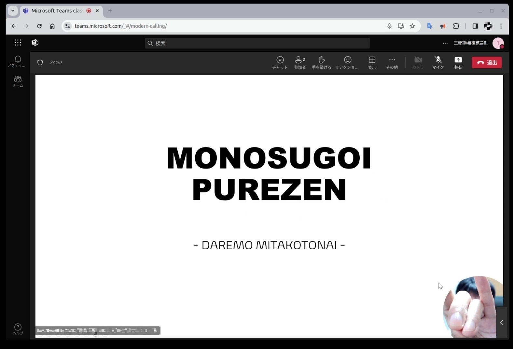

Windowsの画面に、ワイプ（円形のカメラ映像）を表示します。  
ビデオ会議にどうぞ。

### ビルド方法

`HOWTO-BUILD.md` を参照。  
（ビルド済みのEXEファイルだけダウンロードしたい場合、本手順をスキップし次の手順へ）

### インストール方法

1. `HOWTO-BUILD.md` に従い `.exe` を得た場合はそのEXEファイルを、  
   そうでない場合は https://github.com/takahashimasaki4biz/WipeCast/releases から  
   EXEファイルを取得します。  


2. EXEファイルは任意のフォルダに置いてください。

3. 以下の手順でアイコンキャッシュを削除して下さい（初回インストールの場合は不要）

- PowerShellを開き、以下を実行します（あらかじめPowerShellに実行権限を付与しておくこと）。

```PowerShell
Remove-Item -Path $env:USERPROFILE\AppData\Local\Microsoft\Windows\Explorer\iconcache* -Force

Stop-Process -Name explorer -Force

exit
```

### 使用方法

1. WipeCast.exe をダブルクリックし、起動します。
  - 少なくとも1台のカメラが必要です。カメラ無し環境のテストはしていません
  - 現状、YUY2形式、NV12形式の映像入力にのみ対応しています
  - 仮想カメラは対応していません

2. ワイプ（円形のカメラ映像）が表示されます。  
   （この時点でカメラの映像が表示されていない場合は、カメラの設定を確認してください）

3. ドラッグ＆ドロップでワイプの位置を移動できます。

4. マウスホイール（またはタッチパッドのピンチアウト/ピンチイン）で、ワイプの大きさを変更できます。

5. 中指クリックでカメラを切り替えます。

6. ワイプをクリックし（=ワイプにフォーカスを当て）、「q」キーを押すと終了します。  
  （タスクバーからウィンドウを閉じてもOKです）

